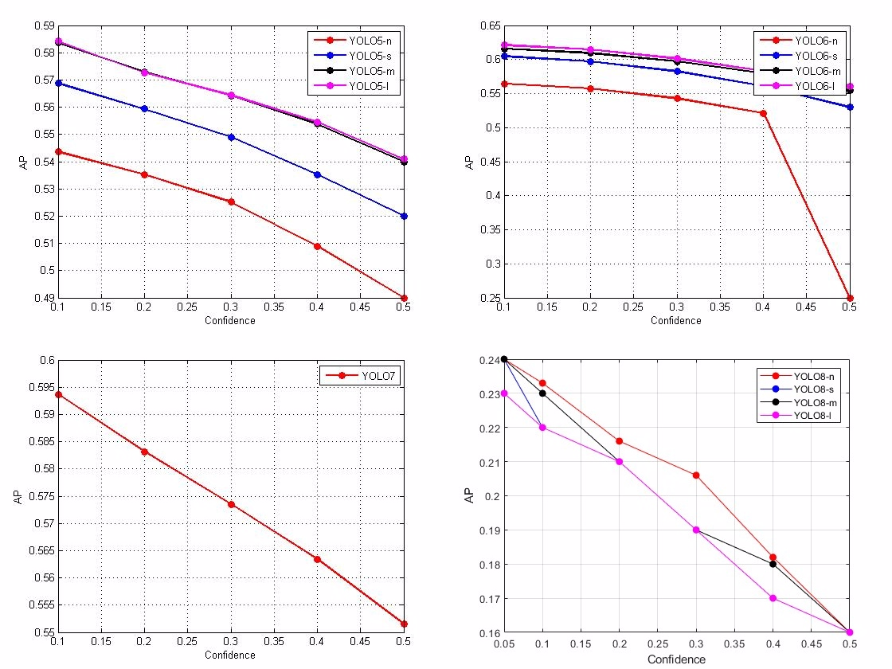
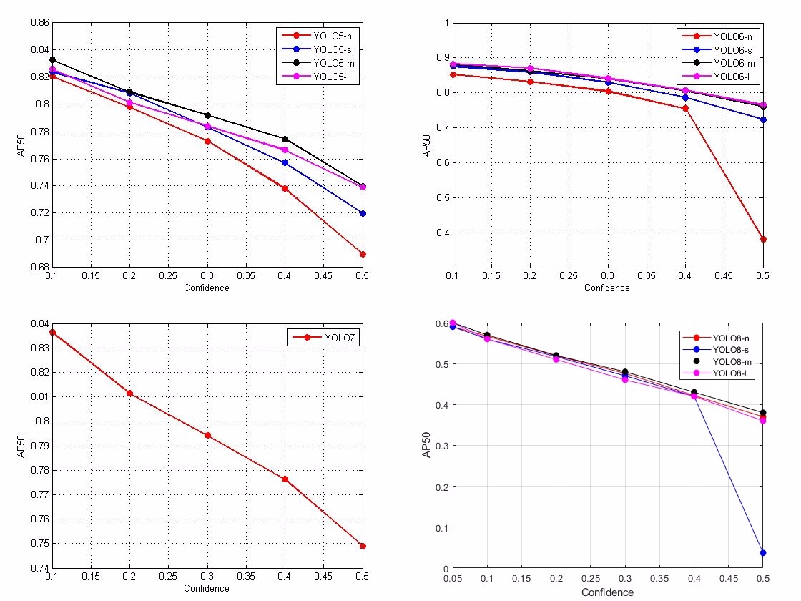
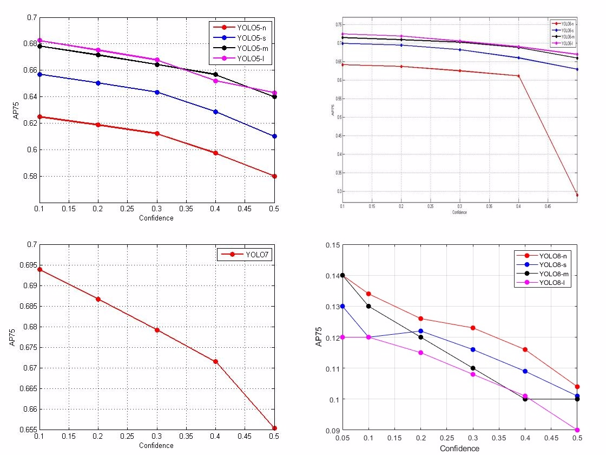
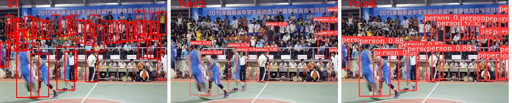
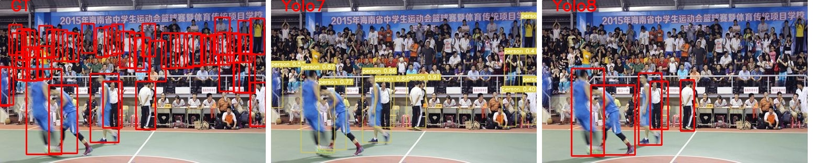

# Pedestrian Detection Using YOLO Algorithm: An Experimental Study

This repository summarize my work in my paper titled **"Pedestrian Detection Using YOLO Algorithm: An Experimental Study."** The paper explores various YOLO versions, such as YOLOv5, YOLOv6, YOLOv7, and YOLOv8, and evaluates their effectiveness in real-time object detection (pedestrain detection) tasks.

# Power of YOLO
Unlike traditional methods that require multiple passes over an image, YOLO is a real-time object detection system that predicts bounding boxes and class probabilities in a single pass. It revolutionized the field by achieving impressive speed and accuracy trade-offs.

In YOLO, the input image is divided into a grid, and each grid cell is responsible for detecting objects present in its spatial region. Multiple bounding box predictions are made within each grid cell, along with corresponding class probabilities. These predictions are refined using convolutional neural networks (CNNs) trained on large-scale datasets.

# A Quick look over YOLO5:8
The general YOLO model is made up of a convolutional neural network (CNN) backbone, a neck, and a head.

### YOLOv5
- **Backbone:** YOLOv5 utilizes CSP-Darknet53, an optimized version of Darknet53
  - **Key Features:** Cross Stage Partial Network (CSP), Spatial Pyramid Pooling Fast (SPPF), SiLU (Swish) Activation
- **Neck:** YOLOv5 incorporates a modified Path Aggregation Network (CSP-PAN)
- **Head:** The final layer, adapted from YOLOv3
- **Loss Functions:** Combination of Localization Loss & Confidence Loss & Classification Loss

### YOLOv6
- **Backbone:** **RepBlock:** Lightweight and efficient for smaller models. & **CSP-StackRep Block:** More powerful backbone for larger models, capturing intricate visual patterns.
- **Neck:** Modified PAN (Path Aggregation Network) topology, enhancing multi-scale feature fusion.
- **Head:** Efficient decoupled head with a hybrid-channel strategy, optimizing classification and regression tasks separately.
- **Loss Function:** Combination of Classification Loss (VariFocal Loss) & Box Regression Loss & Knowledge Distillation (Self-distillation using KL divergence) & Knowledge Distillation
- **Special Features:** Reparameterization and Quantization (Techniques for optimizing model deployment and inference efficiency) & Knowledge Distillation (Improves accuracy by aligning the predictions of smaller models with those of larger, pre-trained models)

### YOLOv7

- **Backbone:** **E-ELAN Computational Block:** Expands input feature map channels, shuffles feature order, and merges features from different groups, enhancing learning ability without disrupting the gradient path.
  
- **Neck:** **CSPSPP+(ELAN, E-ELAN)PAN:** A combination of Spatial Pyramid Pooling (CSPSPP) and Efficient Layer Aggregation Network (ELAN) blocks. This architecture pools features of different scales to improve accuracy and efficiency.
- **Head:** A series of convolutional layers with batch normalization and ReLU activation functions, concluding with a softmax layer for class prediction. This head architecture ensures efficient and accurate prediction of bounding boxes and object classes.
- **Loss Functions:** Combining Loss Functions, a weighted combination of loss functions (Binary Cross-Entropy Loss & Categorical Cross-Entropy Loss & Smooth L1 Loss) is employed, optimizing the importance of each loss type to enhance bounding box and label prediction accuracy.

### YOLOv8
- **Backbone:** Utilizes CSPDarknet53 as a feature extractor, similar to YOLOv5 but replaces the CSPLayer with the C2f module. The C2f module is a cross-stage partial bottleneck with two convolutions, enhancing feature extraction.
- **Neck:** The C2f module acts as a more efficient and accurate bottleneck layer that combines high-level features with contextual information, improving detection accuracy by integrating object details with surrounding context.
- **Head:** Comprises a pair of segmentation heads followed by detection heads similar to YOLOv8. The segmentation heads are responsible for semantic segmentation, while the detection heads forecast object bounding boxes, classes, and confidence scores. The final prediction layer combines these outputs for object detection.
- **Loss Functions:** Combination of CIoU (Complete IoU, a modified version of IoU loss) & DFL (Decoupled Fully-connected with Label Smoothing) Loss & Binary Cross-Entropy Loss
- **Special Features:**
  - **Efficient Bottleneck Layers (C2f):** Enhances feature extraction by combining high-level object details with contextual information, boosting detection performance. & **Segmentation and Detection Heads:** Dual-purpose heads improve both segmentation and object detection, increasing overall model versatility and accuracy.

### Comparison summarization


## Methodology

### Dataset Description

The **[WiderPerson](https://arxiv.org/pdf/1909.12118v1)** dataset is utilized in this study to evaluate the performance of different YOLO versions for pedestrian detection. The dataset is known for its highly diverse and dense annotations, providing a comprehensive benchmark for pedestrian detection tasks.

- **Diversity and Scale**: The WiderPerson dataset contains a significantly higher number of annotations compared to previous datasets like CityPersons. It offers more than ten times the number of bounding boxes and covers a wider range of scales. The distribution of pedestrian sizes in the dataset is relatively uniform, making it a robust choice for training and testing.

- **Density**: On average, there are approximately 28.87 persons per image, which is considerably higher than what is found in other pedestrian detection datasets. This high density ensures that models trained on this dataset are well-equipped to handle crowded scenes.

- **Annotations and Labels**: The dataset provides five fine-grained labels:
  - Pedestrians
  - Riders
  - Partially-visible persons
  - Crowd
  - Ignore regions

  These labels help in distinguishing between different types of objects and scenarios, such as partially visible pedestrians or groups of people.

- **Quality Assurance**: Multiple annotators have carefully checked and pre-filtered the annotations to ensure their quality and reliability. The dataset is divided into three subsets:
  - Training set
  - Validation set
  - Testing set

  This facilitates comprehensive evaluation and model benchmarking.

- **Benchmarking**: An online benchmark is also available for the WiderPerson dataset, allowing researchers to compare their models' performance with existing methods.

### Dataset Preparation
The WiderPerson dataset’s diversity and density make it a valuable resource for training and testing pedestrian detection models, offering a more challenging environment compared to traditional datasets. To prepare the dataset for finetuning, kindly refer to **my Widerperson_preparation** repo.

# Experimental Setup

After preparing Widerperson dataset. We had **finetuning on widerperson & run predictions** all the YOLO versions from 5 to 8 with all sizes (nano, small, medium, large). To know how to run, please refer to how_to.txt that will help in applying YOLO models to predict on the dataset.

### Performance Metrics

for object detection performance, very modular way and representitive metrics is known to measure the performance of object detectors as IoU, precision, recall. In this study, we are not aiming to select the best model for pedestrain detection. But also do deep analysis, for that, to assess the performance of different YOLO versions, we analyze model behavior over different IoU thresholds and confidence values. Using the following:

- **Average Precision (AP):**
  - Combines precision and recall into a single value. providing a balanced measure of a model's accuracy and its ability to identify all relevant objects.
  - Calculated by computing the area under the precision-recall curve.
  - **Importance**: AP is a comprehensive metric that reflects both the precision (the accuracy of the predictions) and recall (the ability to capture all relevant instances). It is especially useful for comparing models as it accounts for both false positives and false negatives.


- **IoU Thresholds for AP Calculation:**
  - **AP@0.5:0.05:0.9**: Average Precision evaluated at multiple IoU thresholds from 0.5 to 0.9 in steps of 0.05.
    - **Importance**: By evaluating performance at various IoU thresholds, this metric provides a more detailed understanding of how well a model performs across different levels of localization accuracy, helping to assess its robustness.
  - **AP@0.5**: Evaluates model performance with an IoU threshold of 0.5 (50% overlap).
    - **Importance**: A common metric for assessing general object detection performance. It is more lenient, allowing for some localization error, which is useful for general object detection tasks.
  - **AP@0.75**: Evaluates model performance with an IoU threshold of 0.75 (75% overlap).
    - **Importance**: This metric is more stringent and emphasizes precise localization. It is important for applications requiring high accuracy in object localization, such as autonomous driving or medical imaging.

- **Confidence Levels:**
  - AP values are calculated for confidence levels ranging from 0.1 to 0.5 in steps of 0.1.
  - Only considers predicted boxes with confidence values above or equal to the threshold.
  - **Importance**: Analyzing performance across different confidence thresholds helps to understand how model predictions vary with confidence levels. This is crucial for fine-tuning models to optimize performance based on the desired balance between precision and recall, especially in applications where the cost of false positives and false negatives differs.

## Results and Discussion
In this section, we show the results of the evaluation metrics after finetuning the models. the following figure shows the **Average precision AP with different confidence threshold**:


The following figure shows the results on the **AP@50 with different confidence threshold**:



The following figure shows the results on the **AP@75 with different confidence threshold**:


- **Discussion**:
  - Comparing all the figures above, **we can notice confidence drawback in all the models**. Figures shows acceptable AP when the confidence threshold = 0.1 And when increasing the confidence threshold the AP decrease dramatically.
  - **for AP@50 and AP@75**, Comparing each version with it self on those different IoU threshould. We can notice that, on AP@50 values are much higher than AP@75. meaning that objects are detected but the overlap between GT and pred is less that 0.75 but above 0.5. **Which led to localization ability of those models needs futher improvement.**  

- The following figures show sample of prediction as qualitative analysis:




## Conclusion

From the deep analysis demonstrated above. Notably, **YOLOv6l** demonstrated superior performance, particularly in accurate pedestrian detection, showcasing its potential as a robust choice for real world applications. The observed challenges in achieving perfect object localization, especially for smaller objects, underscore the need for continuous refinement in object detection methodologies.

## Future Work
Building on the findings of this study, future research efforts can focus on addressing specific challenges and advancing the capabilities of YOLO models. Refinement in boundary localization, particularly for smaller objects, stands out as a crucial area for improvement. Investigating techniques to enhance the models’ precision and localization accuracy, especially in scenarios with a high density of small objects, would contribute significantly to the field. **Additionally, exploring methods to mitigate the observed drop in precision from AP@50 to AP@75 could lead to improvements in overall object localization.**

## References

A list of references cited in the paper, following the appropriate citation style.

## Citation
```bibtex
@article{Saad2024yolo_widerperson_comparitive,
    title={Comparitive study for yolo versions on pedestrain detection},
    author={Mahmoud Saad, Eslam Magdy},
    booktitle={arXiv preprint arxiv:},
    year={2024}
}
